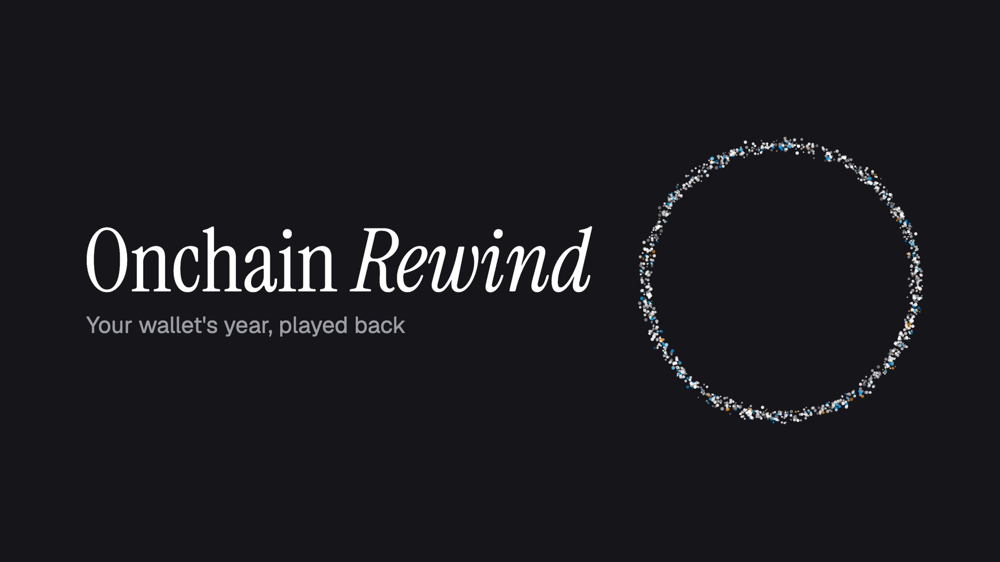

<!-- logo: figlet "ANSI Shadow" — regenerate with:  figlet -f "ANSI Shadow" "REWIND" -->
```
 ██████╗ ███████╗██╗    ██╗██╗███╗   ██╗██████╗
 ██╔══██╗██╔════╝██║    ██║██║████╗  ██║██╔══██╗
 ██████╔╝█████╗  ██║ █╗ ██║██║██╔██╗ ██║██║  ██║
 ██╔══██╗██╔══╝  ██║███╗██║██║██║╚██╗██║██║  ██║
 ██║  ██║███████╗╚███╔███╔╝██║██║ ╚████║██████╔╝
 ╚═╝  ╚═╝╚══════╝ ╚══╝╚══╝ ╚═╝╚═╝  ╚═══╝╚═════╝
```

<div align="center">

# Onchain Rewind

**Your wallet's year, played back.**

A cinematic, data-driven story of any wallet's onchain year, built on the [Zerion API](https://developers.zerion.io).


[](https://github.com/daniboomerang/onchain-rewind/actions/workflows/checks.yml)




</div>

---

## ✦ The idea

Onchain history is public and completely unreadable: a list of hashes, contract calls and token amounts. Onchain Rewind turns a wallet's last 365 days into a story you actually want to watch, and share.

It's built the way it would ship **inside a wallet**: a year-end moment ("Your 2026 Rewind is ready") for a wallet the user has already connected. In this demo you set the wallet once, and every load plays the Rewind.

## 🎬 The experience

```
  settings ──▶ ░▒▓ particle reveal ▓▒░ ──▶ 01 ──▶ 02 ──▶ 03 ──▶ 04 ──▶ 05
  (once)       each dot is a real tx       origin  chain  token  ride   share
```

| | Moment | What you see |
|---|---|---|
| ⚙️ | **Settings** | Paste an address or ENS name, or pick a demo wallet. It's remembered on this device. The gear stays in the corner. |
| ✨ | **The reveal** | A particle field where **every particle is a real transaction** streaming in from the API. The loading state *is* the animation. The particles gather into a ring, count up, and burst into the story. |
| 01 | **Origin** | *It started on March 14, 2022*, and how many days you've been onchain. |
| 02 | **Home chain** | *You live on Base*: animated bars for every chain you touched. |
| 03 | **Top token** | Your most-traded token and how its price moved. |
| 04 | **The ride** | Your portfolio's year in one line that draws itself, with the peak and the low. |
| 05 | **Share** | A summary card, exported as a 1200×630 image for any social feed. |

**Controls:** click left or right (or ← →) to move between cards, and hold or press Space to pause. **Reduced motion** swaps every animation for calm crossfades.

## 🧱 How it's built

```
Browser                                          Server (TanStack Start)
───────                                          ───────────────────────
useRewind(address)       ── server fns ──▶        Zerion client
 ├─ pages through transactions                     ├─ API key never leaves the server
 │   └─▶ ParticleReveal.addTransactions(n)         ├─ cache · 429 backoff · typed errors
 ├─ engine: accumulate(page) → RewindFacts         └─▶ api.zerion.io
 └─ RewindPlayer(facts)
```

Three decisions shape it:

1. **🔒 The key stays on the server.** Every Zerion call goes through a TanStack Start server function. The browser only ever sees trimmed, typed data.
2. **🌌 Loading is the animation.** The client streams transaction pages into the particle reveal. The reveal can only finish when the data does.
3. **🧮 A pure engine between API and UI.** `src/engine/` maps raw Zerion responses to a single `RewindFacts` contract, test-first and with no I/O. Components never touch API shapes.

### Stack

| Layer | Choice |
|---|---|
| Framework | **TanStack Start** (React 19, Vite 8, file routes, server functions) |
| Language | **TypeScript**, strict + `noUncheckedIndexedAccess` |
| Styling | **Tailwind CSS v4**, with design tokens as CSS variables |
| Primitives | **Ariakit**: Dialog, Combobox, Tooltip, behind a thin wrapper layer |
| Motion | **Motion** for UI, **Canvas 2D** for the particle reveal (no WebGL) |
| Data | **Zerion API** · TanStack Query · **viem** for ENS |
| Quality | **Biome** (lint + format) · **Vitest** · GitHub Actions |
| Deploy | **Vercel** |

## 🎨 Design system

Designed first, built second. The full handoff lives in [`design/`](design/):
- **Tokens:** dark-first palette, Instrument Serif for the story, Geist with tabular numbers for every figure, and motion durations, easings and springs as tokens.
- **Components:** a reference implementation of every component with all its states.
- **Screens and motion spec:** every screen, and what moves on it, in what order.
- **Data contract:** [`types.ts`](design/types.ts).

A live `/system` route renders every component in every state.

## 🤖 Built AI-native, under governance

This repo is set up so coding agents build it **reliably**, not just quickly:

- **[`AGENTS.md`](AGENTS.md)** is the single source of truth for every agent (Codex, Claude Code…). [`CLAUDE.md`](CLAUDE.md) imports it.
- **Path rules** in [`.claude/rules/`](.claude/rules/) load automatically when an agent touches matching files: Zerion API, engine, design system, motion, TanStack Start.
- **Workflow skills** run on demand: [`verify-ui`](.claude/skills/verify-ui/SKILL.md), [`ship-check`](.claude/skills/ship-check/SKILL.md), [`vet-demo-wallet`](.claude/skills/vet-demo-wallet/SKILL.md), [`record-fixture`](.claude/skills/record-fixture/SKILL.md). [`.agents/skills/`](.agents/skills/) holds pointers for Codex.
- **Rules are enforced by tools, not prose.** A lint rule bans raw Ariakit imports outside the wrapper layer, and a build check makes sure the API key never appears in the client bundle. CI blocks on format, lint and types.
- **Governed by [Vinaya](https://vinaya.attalabs.dev):** every agent change goes through a brief, review rounds and a human test-plan gate before it merges.

## 🗺️ Roadmap

- [x] Spec, design handoff, agent config, CI checks
- [x] Scaffold: TanStack Start, Tailwind v4 tokens, pinned stack
- [ ] Design system foundation and `/system` playground
- [ ] Zerion server layer
- [ ] Rewind engine (test-first)
- [ ] Settings and wallet
- [ ] The Rewind flow on real data
- [ ] Share image, deploy

The full plan, with boundaries and acceptance criteria for each task, is in [SPEC.md](SPEC.md).

## 🚀 Run it

```bash
bun install
cp .env.example .env.local   # add your free Zerion API key
bun dev                      # http://localhost:3000
```

| Script | |
|---|---|
| `bun run check` | format + lint + types, the same as CI |
| `bun run fix` | auto-format and organise imports |
| `bun test` | unit tests |
| `bun run build` | production build |

Get a free key at [developers.zerion.io](https://developers.zerion.io). It's read only on the server.

---

<div align="center">

Built by **[Dani Estevez](https://github.com/daniboomerang)** · governed by **[Vinaya](https://vinaya.attalabs.dev)** from **AttaLabs**

<sub>Onchain data from the Zerion API. Not affiliated with Zerion.</sub>

</div>
